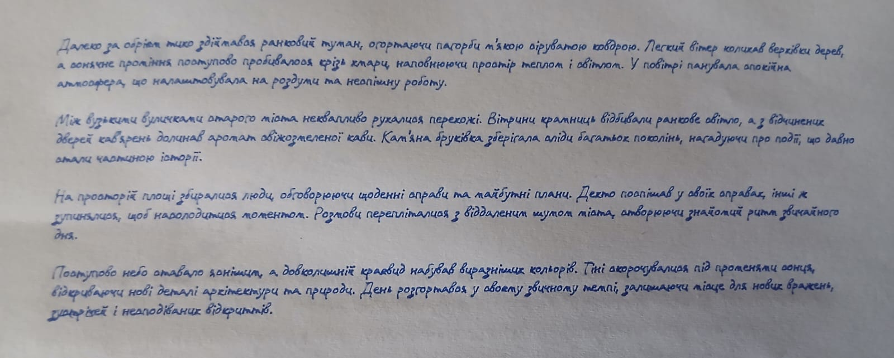

# txt2plot — інструменти для пен-плотера на GRBL

Набір Python-утиліт для керування пен-плотером на базі GRBL з текстових файлів. Повна підтримка кирилиці (українська мова).



## Яку проблему вирішує

Більшість інструментів для пен-плотерів розраховані на AxiDraw або платне ПО. Однолінійні шрифти («Hershey») — що дозволяють плотеру малювати літери одним безперервним рухом без заповнення контуру — майже виключно латинські. Безкоштовних Hershey-шрифтів з кирилицею практично немає.

Цей набір вирішує обидві проблеми:

- **`text_to_gcode.py`** — конвертує `.txt`-файл безпосередньо в G-code посторінково: перенос слів, пагінація, портретна/ландшафтна орієнтація, точні відступи — все автоматично.
- **`plot.py`** — стрімер G-code на плотер з оптимальним заповненням буфера GRBL (128 байт). Тримає буфер постійно повним → плавний рух без пауз між командами (bCNC не робить цього і плотер «заїкається»).
- **`set_zero.py`** — інструмент для коригування нульової точки: переміщує перо в поточний `(0, 0)`, дозволяє зберегти нову нульову точку та намалювати калібрувальні куточки для перевірки.
- **`centerline.py`** *(опціонально)* — конвертує будь-який контурний шрифт TTF/OTF в однолінійний Hershey SVG-шрифт. Саме так отримати кирилицю: взяти будь-який шрифт з підтримкою української (Caveat, Kobzar KS тощо) і конвертувати.

## Обладнання

Протестовано з плотером на прошивці **DrawCore V2.21 (GRBL 1.1h)**.

- Підключення: USB serial (`/dev/ttyACM0` на Linux, `COM3` / `COM4` на Windows — див. [Налаштування](#налаштування))
- Робоча область: 210 × 297 мм (A4)
- Керування пером по осі Z: **Z5** = перо вниз (малює), **Z3** = перо вгору (перехід)

## Встановлення

### Linux

```bash
pip install vpype vpype-gcode pyserial

git clone https://github.com/your-username/txt2plot.git
cd txt2plot
```

### Windows

1. Встановіть [Python 3.10+](https://www.python.org/downloads/) — під час встановлення поставте галочку **«Add Python to PATH»**.
2. Відкрийте **Command Prompt** або **PowerShell**:

```powershell
pip install vpype vpype-gcode pyserial
```

3. Склонуйте або завантажте репозиторій і перейдіть у його папку.

### Профіль vpype

Файл `vpype.toml` у цьому репозиторії — профіль G-code для DrawCore. `text_to_gcode.py` підхоплює його автоматично, якщо запущений з папки проєкту. Щоб використовувати глобально:

```bash
# Linux / macOS
cp vpype.toml ~/.config/vpype/vpype.toml

# Windows (PowerShell)
cp vpype.toml "$env:APPDATA\vpype\vpype.toml"
```

## Налаштування

Відкрийте `plot.py` і `set_zero.py` та вкажіть правильний порт на початку кожного файлу:

```python
# Linux
PORT = '/dev/ttyACM0'

# Windows — перевірте Диспетчер пристроїв → Порти (COM та LPT)
PORT = 'COM3'
```

## Використання

### 1. Встановлення нульової точки (перший раз або після зміщення паперу)

```bash
python set_zero.py
```

При запуску перо автоматично переміщується в поточний `(0, 0)` — одразу видно де нуль фізично. Скоригуй положення паперу або каретки за потреби, потім:

| Команда | Дія |
|---------|-----|
| `s` | Зберегти поточну позицію як нульову точку і вийти |
| `c` | Намалювати калібрувальні куточки в кутах A4 для перевірки |
| `Ctrl-C` | Вийти без збереження (перо підіймається) |

### 2. Генерація G-code з тексту

```bash
# Портрет, стандартні налаштування (шрифт 5 мм, відступи 20 мм)
python text_to_gcode.py poem.txt --font fonts/myfont_centerline/myfont_centerline.svg

# Ландшафтна орієнтація
python text_to_gcode.py poem.txt --font fonts/myfont_centerline/myfont_centerline.svg \
    --orientation landscape \
    --margin-left 73 --margin-right 80 --margin-top 42 --margin-bottom 20 \
    --size 5 --line-height 7 --line-gap 2

# Попередній перегляд SVG без генерації G-code
python text_to_gcode.py poem.txt --font fonts/myfont_centerline/myfont_centerline.svg \
    --svg-only --output-dir ./preview

# Розмір шрифту і міжрядковий інтервал
python text_to_gcode.py poem.txt --font fonts/myfont_centerline/myfont_centerline.svg \
    --size 6 --line-height 9 --line-gap 1

# Зберегти в окрему папку з власним префіксом
python text_to_gcode.py poem.txt --font fonts/myfont_centerline/myfont_centerline.svg \
    --output-dir ./output --prefix poem

# Продовжити з рядка N на першій сторінці (папір скінчився посередині)
python text_to_gcode.py poem.txt --font fonts/myfont_centerline/myfont_centerline.svg \
    --start-line 12
```

**Параметри:**

| Параметр | За замовч. | Опис |
|----------|-----------|------|
| `--orientation` | `portrait` | `portrait` або `landscape` |
| `--size MM` | `5.0` | Em-розмір шрифту в мм (лише масштаб гліфів) |
| `--line-height MM` | `size × 1.5` | Фіксована висота слоту на рядок (baseline-to-baseline), незалежно від вмісту |
| `--line-gap MM` | `0` | Додатковий відступ між рядками (leading). Повний крок = `line-height + line-gap` |
| `--margin-top MM` | `20` | Верхній відступ в орієнтації читання |
| `--margin-bottom MM` | `20` | Нижній відступ |
| `--margin-left MM` | `20` | Лівий відступ |
| `--margin-right MM` | `20` | Правий відступ |
| `--page-width MM` | `210` | Коротка сторона паперу (A4 = 210) |
| `--page-height MM` | `297` | Довга сторона паперу (A4 = 297) |
| `--font PATH` | *(обов'язковий)* | Шлях до Hershey SVG-шрифту |
| `--output-dir DIR` | `.` | Папка для файлів виводу |
| `--prefix NAME` | `page` | Префікс імен файлів |
| `--start-line N` | `0` | Пропустити перші N рядків на першій сторінці |
| `--svg-only` | — | Тільки SVG, без G-code |

> **Ландшафт:** папір лежить на плотері портретно як завжди. Скрипт повертає вміст на 90° проти годинникової стрілки всередині SVG. Щоб прочитати надрукований текст — поверни аркуш на 90° проти годинникової стрілки. Усі відступи вказуються в орієнтації читання.

### 3. Друк

```bash
python plot.py page_0001.gcode
python plot.py page_0002.gcode
```

**Ctrl-C** у будь-який момент — скрипт підніме перо і повернеться в домашню позицію.

### Друк SVG-файлу

Якщо є готовий SVG з Inkscape або іншої програми:

```bash
# Конвертуй текст у шляхи (Inkscape CLI)
inkscape input.svg --export-text-to-path --export-plain-svg --export-filename=input_paths.svg

# Генерація G-code
vpype -c vpype.toml read input_paths.svg \
  linemerge --tolerance 0.5mm \
  linesort \
  gwrite --profile drawcore output.gcode

python plot.py output.gcode
```

---

## centerline.py — конвертація будь-якого шрифту в однолінійний

Утиліта рендерить кожен гліф через FreeType, скелетонізує растр (алгоритм Чжан-Суена), трасує скелет в полілінії за алгоритмом Ейлера (мінімум підйомів пера), спрощує Рамером-Дугласом-Пекером, апроксимує кубічними кривими Без'є та записує результат як Hershey SVG-шрифт (сумісний з `text_to_gcode.py` і розширенням Hershey Text для Inkscape).

### Навіщо вона потрібна

Безкоштовних однолінійних шрифтів з кирилицею практично не існує. `centerline.py` дозволяє взяти будь-який TTF/OTF-шрифт з підтримкою потрібної мови і отримати готовий однолінійний варіант для плотера.

### Додаткові залежності

`centerline.py` потребує бібліотек, які не потрібні решті утиліт:

```bash
pip install freetype-py fonttools numpy scikit-image scipy
```

На Windows `freetype-py` зазвичай включає потрібну DLL, але якщо при імпорті виникає помилка — встановіть [FreeType для Windows](https://github.com/ubawurinna/freetype-windows-binaries) вручну.

Вихідні TTF/OTF-файли і результат конвертації можна зберігати в папці `fonts/`.

### Використання

```bash
# Конвертувати шрифт (латиниця + кирилиця, всі друковані символи)
python centerline.py fonts/myfont.ttf

# Вища роздільна здатність рендеру для тонких або деталізованих шрифтів
python centerline.py fonts/myfont.ttf --render-size 400

# Тільки вказані символи
python centerline.py fonts/myfont.otf --glyphs "АБВГДЕЄЖЗИІЇЙКЛМНОПРСТУФХЦЧШЩЬЮЯабвгдеєжзиіїйклмнопрстуфхцчшщьюя"

# Тільки Hershey SVG-шрифт, без UFO і покрокових SVG
python centerline.py fonts/myfont.ttf --no-ufo --no-svg
```

**Параметри:**

| Параметр | За замовч. | Опис |
|----------|-----------|------|
| `--render-size PX` | `300` | Висота рендеру FreeType у пікселях. Збільш для тонких/декоративних шрифтів |
| `--rdp-epsilon` | `1.5` | Допуск спрощення Рамера-Дугласа-Пекера в пікселях |
| `--spur-size N` | `12` | Обрізати тупикові гілки скелету коротші за N пікселів (прибирає артефакти растеризації) |
| `--min-component N` | `10` | Видалити фрагменти скелету менші за N пікселів. Збільш для тонких/геометричних шрифтів |
| `--glyphs STRING` | всі друковані ASCII + кирилиця | Символи для обробки |
| `--out-dir DIR` | поруч із шрифтом | Папка виводу |
| `--no-ufo` | — | Не записувати UFO 3-шрифт |
| `--no-svg` | — | Не записувати SVG для кожного гліфа окремо |
| `--no-hershey` | — | Не записувати Hershey SVG-шрифт |

**Результат** (у папці `fonts/<НазваШрифту>_centerline/`):
- `<НазваШрифту>_centerline.svg` — Hershey SVG-шрифт для `text_to_gcode.py` і Inkscape Hershey Text
- `<НазваШрифту>_centerline_specimen.svg` — зведений огляд усіх гліфів
- `<НазваШрифту>_centerline.ufo` — UFO 3-шрифт (відкривається у FontForge / RoboFont)
- `svg/` — SVG-файл для кожного гліфа окремо

Передати шрифт у `text_to_gcode.py`:

```bash
python text_to_gcode.py poem.txt --font fonts/myfont_centerline/myfont_centerline.svg
```

В **Inkscape Hershey Text**: `Extensions → Text → Hershey Text → Font face: Other` → вказати повний шлях до `.svg`-файлу.

---

## Примітки

- Це **не** інструмент для AxiDraw — `axicli` несумісний з DrawCore/GRBL-обладнанням.
- `plot.py` тримає 128-байтний GRBL-буфер постійно заповненим → плавний рух з постійною швидкістю. bCNC надсилає команди по одній, через що плотер гальмує і смикається між ходами.
- SVG має вісь Y вниз, GRBL — вгору; `vertical_flip = true` у профілі vpype компенсує це автоматично.
